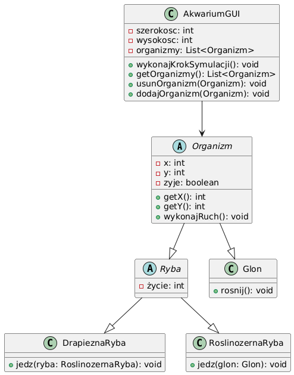

# Symulacja Akwarium



## Opis projektu

Symulacja Akwarium to aplikacja napisana w języku Java z wykorzystaniem biblioteki Swing, która symuluje ekosystem akwarium z trzema typami organizmów:

- **Ryby drapieżne** - polują na ryby roślinożerne
- **Ryby roślinożerne** - żywią się glonami
- **Glony** - rozmnażają się na pustych polach

Aplikacja pozwala na obserwację interakcji między organizmami w zamkniętym ekosystemie oraz wpływu różnych parametrów na równowagę ekologiczną.

## Funkcjonalności

- Symulacja ekosystemu akwarium w czasie rzeczywistym
- Trzy typy organizmów z różnymi zachowaniami
- Kontrola nad parametrami symulacji (liczba organizmów, prędkość symulacji)
- Możliwość zmiany rozmiaru akwarium
- Wizualizacja stanu akwarium z kolorowym oznaczeniem organizmów
- System logowania zdarzeń zachodzących w symulacji
- Możliwość wykonywania symulacji krok po kroku

## Wymagania systemowe

- Java 11 lub nowsza
- Gradle 7.0 lub nowszy

## Instalacja i uruchomienie

1. Sklonuj repozytorium:
   ```
   git clone [adres-repozytorium]
   ```

2. Przejdź do katalogu projektu:
   ```
   cd fish-sim
   ```

3. Zbuduj projekt za pomocą Gradle:
   ```
   ./gradlew build
   ```

4. Uruchom aplikację:
   ```
   ./gradlew run
   ```

## Jak korzystać z aplikacji

1. Po uruchomieniu aplikacji zobaczysz główne okno z siatką akwarium, panelem sterowania i panelem logów.
2. Użyj przycisków w panelu sterowania, aby:
   - **Start** - uruchomić symulację
   - **Stop** - zatrzymać symulację
   - **Wykonaj krok** - wykonać pojedynczy krok symulacji
   - **Reset** - zresetować symulację z aktualnymi parametrami
3. Dostosuj parametry symulacji:
   - Prędkość symulacji za pomocą suwaka
   - Liczba drapieżników, ryb roślinożernych i glonów za pomocą spinnerów
   - Rozmiar akwarium (szerokość i wysokość)
4. Po zmianie rozmiaru akwarium lub liczby organizmów kliknij przycisk "Zastosuj zmiany".
5. Obserwuj logi symulacji w dolnym panelu, aby śledzić zdarzenia zachodzące w akwarium.

## Struktura projektu

Projekt jest zorganizowany w następujące pakiety:

- `akwarium` - pakiet główny
  - `gui` - klasy interfejsu użytkownika
  - `logika` - klasy odpowiedzialne za logikę symulacji
  - `model` - klasy reprezentujące organizmy

### Główne klasy

- `Main` - punkt wejścia aplikacji
- `AkwariumGUI` - główne okno aplikacji
- `Symulacja` - zarządza przebiegiem symulacji
- `Akwarium` - reprezentuje model akwarium
- `Organizm` - abstrakcyjna klasa bazowa dla wszystkich organizmów
- `Ryba` - abstrakcyjna klasa bazowa dla ryb
- `DrapieznaRyba` - reprezentuje rybę drapieżną
- `RoslinozernaRyba` - reprezentuje rybę roślinożerną
- `Glon` - reprezentuje glon

## Dokumentacja

Szczegółowa dokumentacja kodu znajduje się w katalogu `docs/`:
- [Dokumentacja kodu](docs/dokumentacja_kodu.md)
- [Diagram klas](docs/diagramKlas.png)
- [Diagram obiektów](docs/diagramObiektow.png)
- [Diagram sekwencji](docs/diagramSekwencji.png)
- [Diagram maszyny stanów](docs/diagramMaszynyStanow.png)

## Autorzy

Projekt został stworzony jako część kursu programowania obiektowego.
